# The Leaf Area Script
## Semi-automated Leaf Area measurement

Measurement of leaf area from flatbed scans is probably the most common approach. While there are a few available software solutions, they tend to be decades old, unreliable, OS-specific, opaque, and lacking batch processing of multiple images. Honorable mention goes to [the LeafArea R package](https://cran.r-project.org/web/packages/LeafArea/index.html) for the idea of relying on [ImageJ](https://imagej.net/), an actively maintained open-source image processing software with macro support. I couldn't make this package work, it's not as actively maintained as ImageJ itself, and my approach is slightly different, but I have to acknowledge it was the inspiration for this solution. 

More complex image processing software than ImageJ exists, but not all of them are FOSS or support automation; ImageJ is more than sufficient for the simple task of measuring leaf area from scans (there is an example in their documentation).

This is a script that allows the measurement of total leaf area from several scans at once with either ImageJ or Fiji, providing options to deal with most real-world imperfections and supplementary output to check that the procedure was successful.

## Details

The script accepts color, grayscale or B/W images in most raster image formats. After converting to 8-bit grayscale, the image is transformed into binary with a threshold, either using ImageJ's automatic detection or a manual threshold (0-255). In theory, all threshold or color threshold algorithms in ImageJ can be supported.

Next, the "Analyze particles" function is used to measure the area of individual particles. Holes within particles (objects) are filled, while objects touching the edge of the image are excluded. The script passes other options to this function, such as the minimum and maximum size for the particles in pixels (useful to exclude dust and dirt specks) and thresholds for circularity of the objects.

Pixel counts of all objects are summed for each image, and converted to mm^2. It is common to have one leaf for each scan, even if in separate pieces. For several leaves in each scan, an option is to edit the images beforehand, or to use the raw pixel counts in the "particles" subfolder.

I provide two options which I find convenient (the ImageJ GUI requires you to click on the image or have a reference object in the scan, while the LeafArea package requires both a pixel measurement and a physical measurement, the latter usually page width):
- DPI mode: provide the DPI at which the image was scanned. This is used to calculate the area of a pixel, and then the total leaf area
- Page mode: provide the page size for the scanned area. Given the physical size and the pixel size of the image, it is again possible to calculate the area of a pixel

The script asks for another option, "trim", which is a number of pixels removed symmetrically from both width and height of the image before calculations. This is useful to correct for misalignments in the scan, which result in dark edges that could be counted in the leaf area. Since "Analyze particles" ignores particles touching the edges by default, setting this too high could exclude entire leaves from the measurement. This is preferable to the alternative behaviour, measuring leaves even if they are cropped and silently ignoring the issue.

### Suggestions

- Prefer color images as starting point. You can always go color -> grayscale -> binary but not vice-versa. Each step to the left contains more information that can be useful to correctly detect the leaf margin
- Auto threshold works most of the time, but you can always try a manual threshold on problematic images
- 1000 is a good starting point for minimum particle size. This corresponds to an area of roughly 7.2 mm^2 at 300 dpi
- A good starting point for "trim" is 100, but a better value can be derived by opening the image in an editing software such as GIMP.
- scan DPI doesn't need to be high: at 100 dpi a pixel is already as small as 0.06 mm^2, which is smaller than any other measurement error. That said, there's no harm going up to 300 dpi, which is commonly used
- knowing DPI is useful because pixel size can be derived directly for any image, instead of relying on the image matching perfectly with a known paper size or other physical reference

## Requirements

- [ImageJ](https://imagej.net/ij/download.html) or [Fiji](https://fiji.sc/) (installed through a repository or downloaded to a folder)
- [Python 3](https://www.python.org/downloads/) (used for pixel-to-area conversion and data wrangling)
- [Pillow](https://pillow.readthedocs.io/en/latest/installation/basic-installation.html) Python library. Only needed for the paper size mode. If you only use DPI mode, it is not necessary.

## Usage

### Linux / Mac - repository (recommended)

This version assumes that `imagej` is in a directory within $PATH (i.e., it can be called from terminal as `imagej`). This is the default when installed through a repository.

1. put `leafarea.ijm` and `run_leafarea.sh` in the same folder as your images
2. run `run_leafarea.sh`. Choose threshold, trim, particle size and circularity (empty uses the defaults)
3. the results will be stored in a "results" folder. `summary.csv` stores the total leaf area of each image in mm^2
4. the "particles" and "outlines" subfolders are for checking the procedure. Particles contains one CSV for each image, as it is generated by ImageJ. The columns are the source image, area in pixels, x and y coordinates of the centroid. These files are useful to check whether noise and dust particles have been excluded, while leaf particles have been recognized correctly. "Outlines" contains images with outlines of the detected particles, with tiny numbers identifying each particle; these are useful to check whether the threshold is appropriate, and can be compared with the output of the "particles" files.

Tested on Fedora 43 and Linux Mint 22.3.

### Linux / Mac - portable

If, instead, ImageJ is downloaded from the website and saved into a user folder, this version of the script asks for the ImageJ position the first time it is run but is otherwise identical. This is the same behaviour as the Windows version below.

### Windows

In Windows, only the "portable" ImageJ installation is available:

1. Put `leafarea.ijm` and `run_leafarea.ps1` in the same folder as your images
2. Right-click inside the folder to open Powershell (AKA Windows terminal on Win11)
3. (just once) Execute to allow the execution of the script. You will still be warned each time an external script is run, so this is pretty safe
```
Set-ExecutionPolicy -ExecutionPolicy Unrestricted -Scope CurrentUser
```
4. Run `run_leafarea.ps1` with Powershell. If not present, `leafarea.cfg` will be created by asking the ImageJ location. Choose threshold, trim, particle size and circularity (empty uses the defaults)
5. Continue with steps 3 and 4 above

Tested on Windows 11.

### Fiji (all platforms)

Running scripts with Fiji is slightly different than with ImageJ1, so it requires `leafarea_fiji.py` and `run_leafarea_fiji.sh` or `run_leafarea_fiji.ps1`. In this case the Fiji script is in Jython, which is more future-proof in the perspective of ImageJ2 as well, as they are moving away from macros. 
The instructions are otherwise the same as for the portable/Windows versions.

## Testing

The script has been checked with a selection of test images:

- test1, a 100 mm × 100 mm square on a 300 dpi A4 sheet
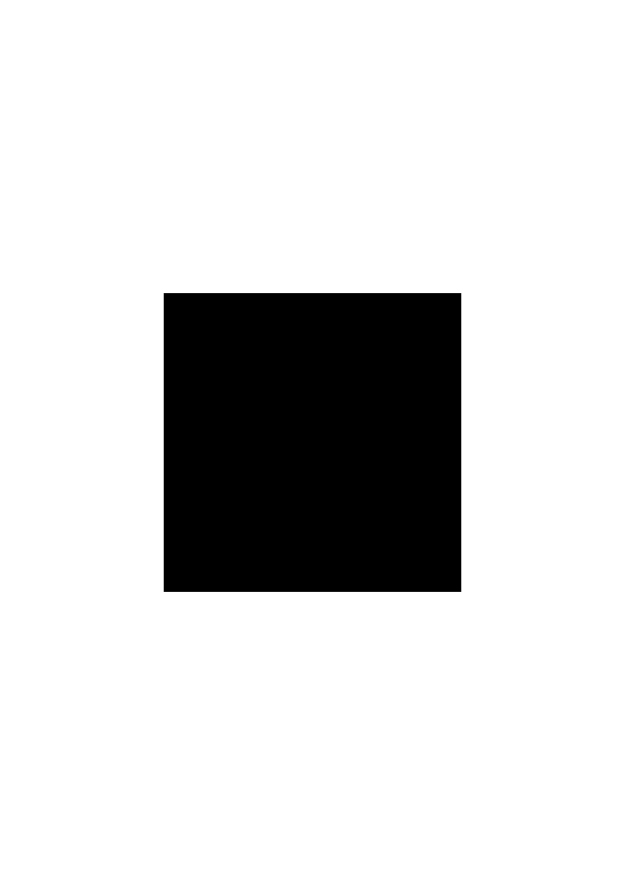
- test2, same as test1 but with a 60 px wide black border to simulate a misaligned paper sheet
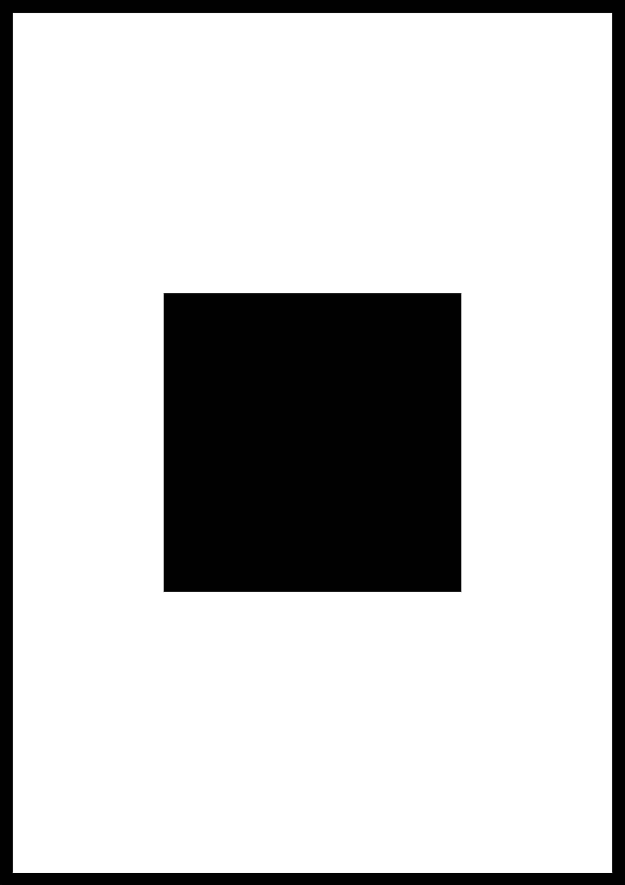
- test3, three separate 30 mm × 30 mm squares
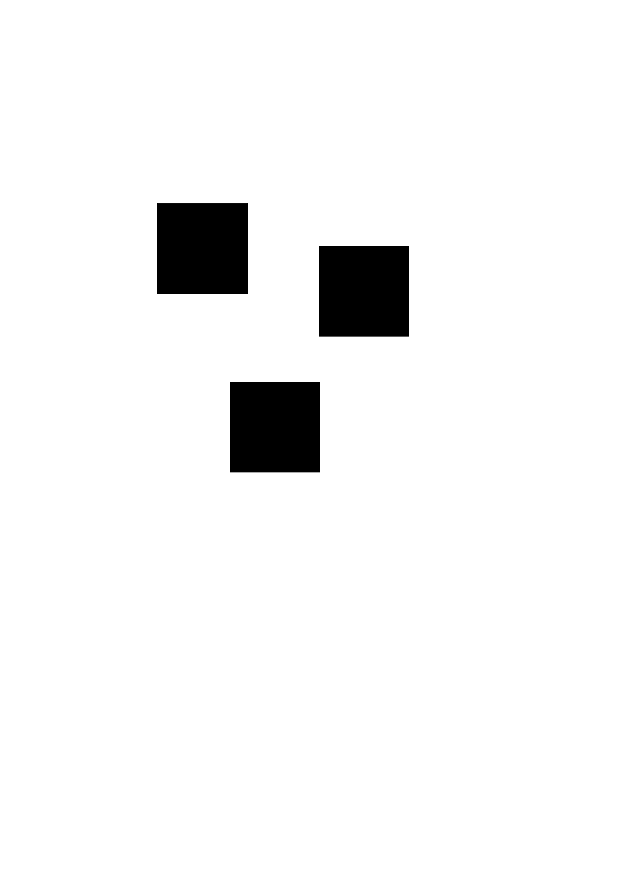
- aremonia, a binary image
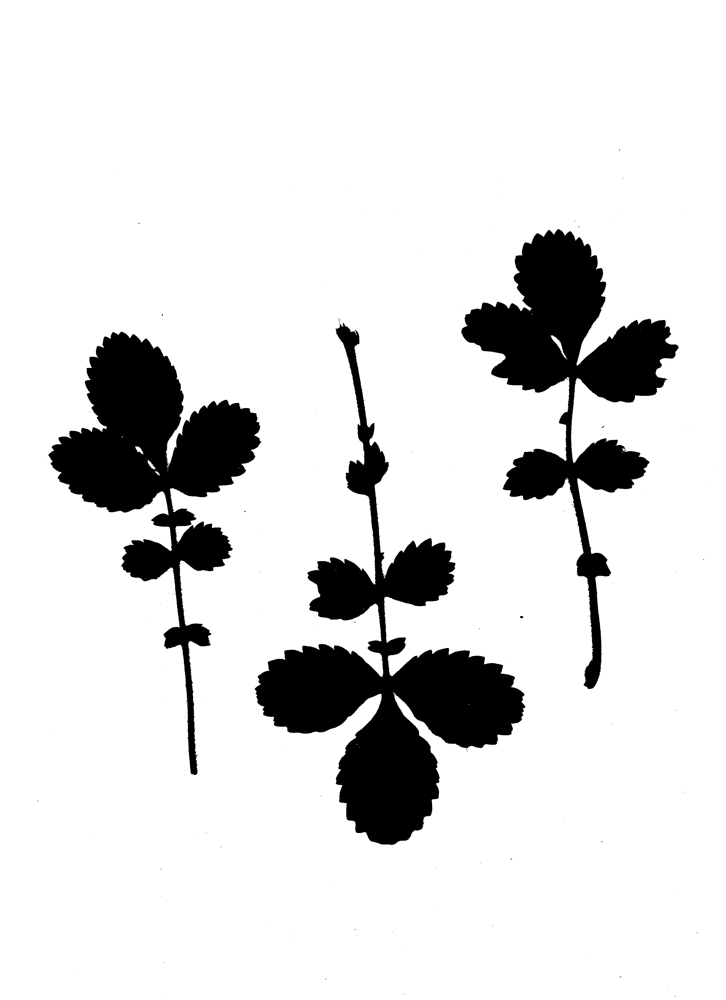
- echinops, a grayscale image with shadows caused by the leaf thickness

- test images from the LeafArea package. For these, the following settings have been chosen to approximate the package defaults: threshold auto, trim 20, minimum size 28 (converted from cm), lower circularity 0, upper circularity 1, paper size 210 x 297 mm.
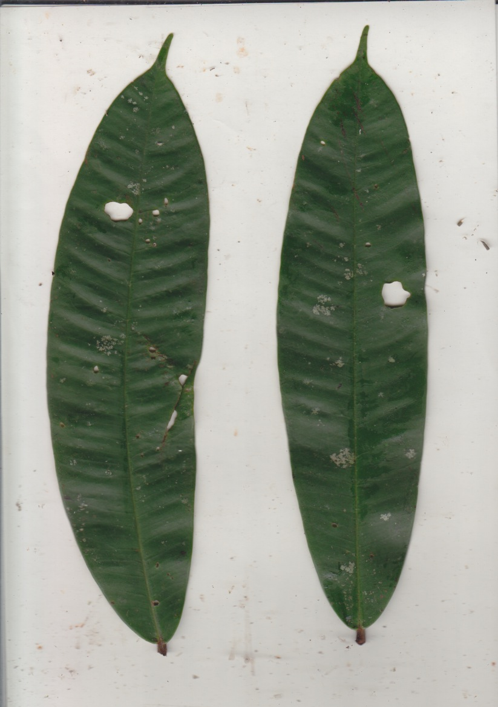
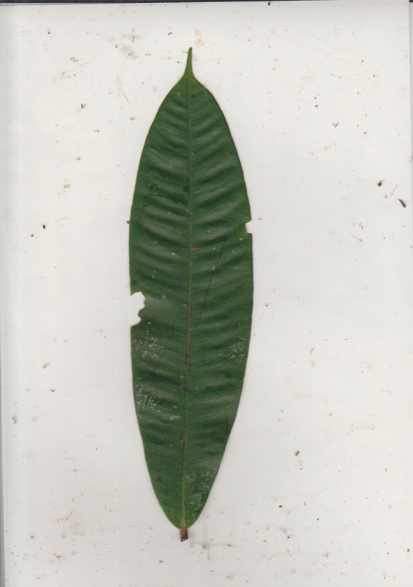
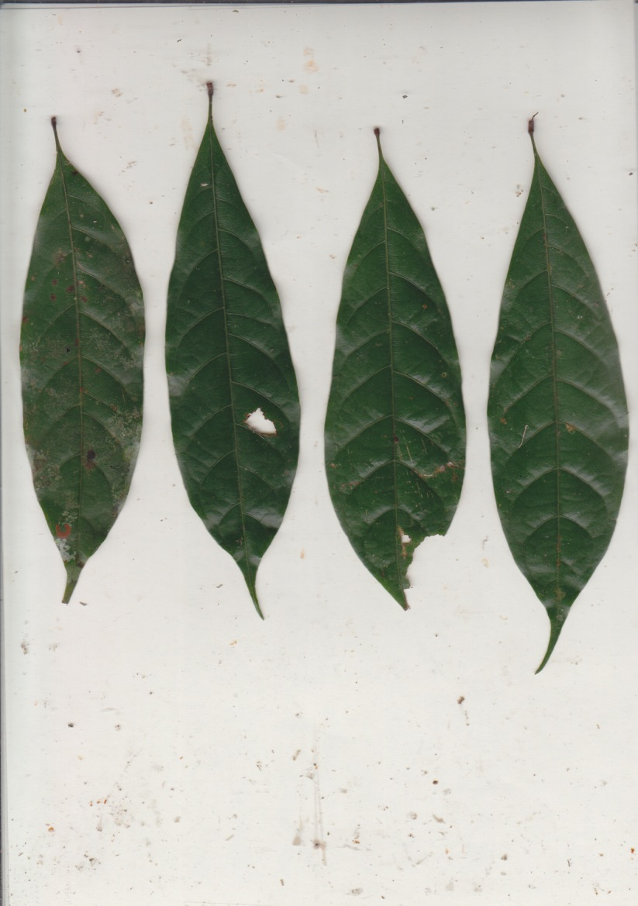
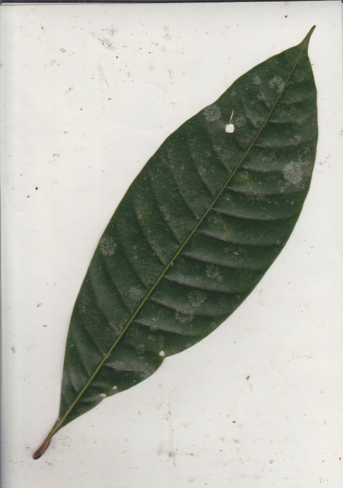
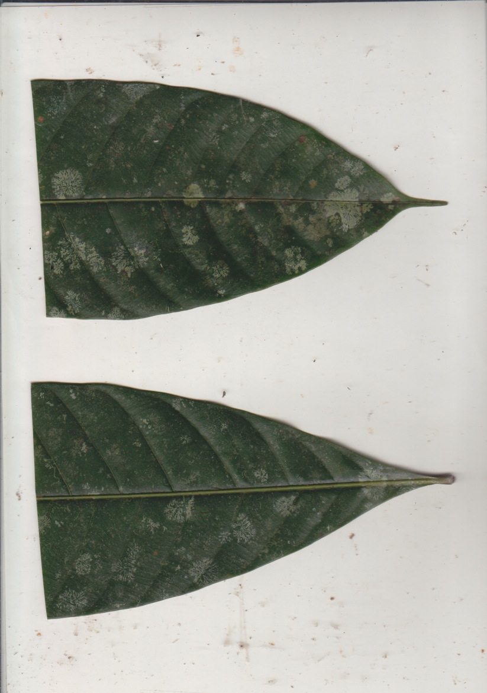
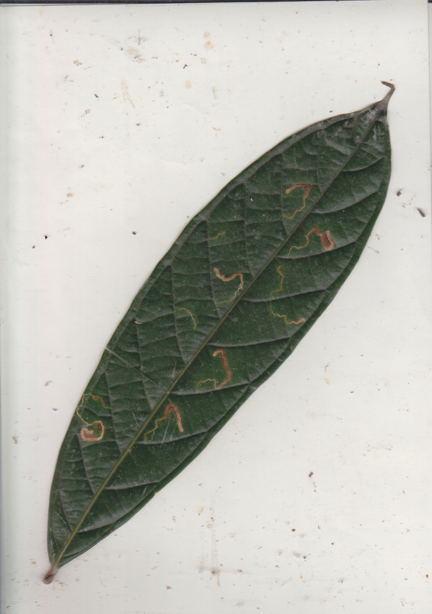
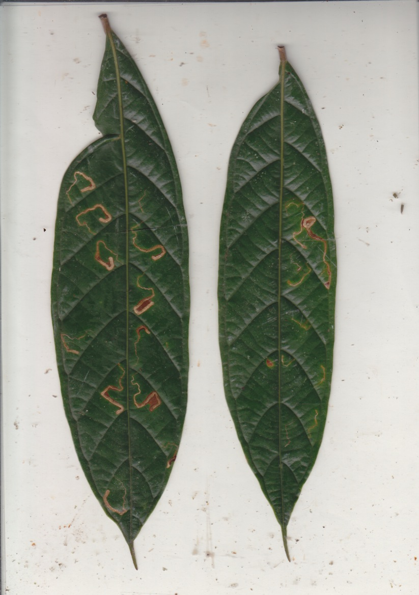

The results on test images are very close to the expected value. For the two real-world bitmaps, the automatic threshold worked well and values are very close to those obtained by other software. For the package images, comparing the areas with those derived from the README example (summing the particles in each image), the error was at most 1.15%, probably due to a different approximation of the pixel area:
|  image | package  |  script | %err  |
|---|---|---|---|
| A1-01  |  24086.8 |  24363.719 | -1.149  |
| A1-02  | 10947.2  |  10994.992 | -0.436  |
| A123-01  | 18477.3  |  18579.393 |  -0.552 |
| A123-02  | 23370  | 23429.745  |  -0.255 |
| A2  |  17718.8 |  17867.778 | -0.840  |
|  A300-1 |  15806.5 | 15856.884  |  -0.318 |
| A300-2  |  22685.4 |  22738.227 |  -0.232 |

## Final remarks

While surveying available tools before making this script, I became aware of how much methodological variation there can be in the measurements, even after the scans were taken. For example: different approaches to converting pixel area to physical area; different thresholds for binary conversion, resulting in erosion or inflation of the leaf margin; removal of dust and dirt particles; filling of the leaf lamina to avoid leaving out more reflective parts (that would be considered as background).

This is my attempt to make the conversion of leaf scans to area measurements more reproducible, objective, and at the same time quicker. I must admit that I'm not an expert coder. I started from the basic idea of a script relying on ImageJ and a feature set, then collected the necessary macro commands using the record tool in ImageJ (basically the only way, since the documentation is insufficient), and finally relied on Claude to put it all together. While external validation is very much welcome, this wouldn't have worked without thorough testing both inside and outside the GUI. I have checked the code myself and then ran the tests above several times. 
If you have feedback, suggestions or new features, open [an issue](https://github.com/LucianoDeBenedictis/leafareascript/issues/new/choose) or [a PR](https://github.com/LucianoDeBenedictis/leafareascript/compare)!
